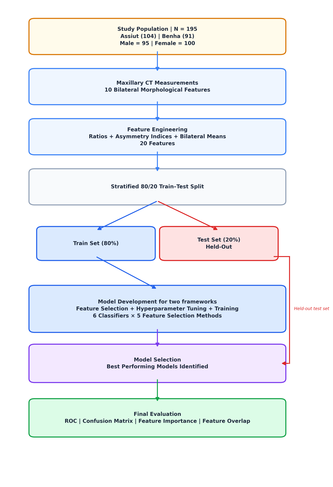
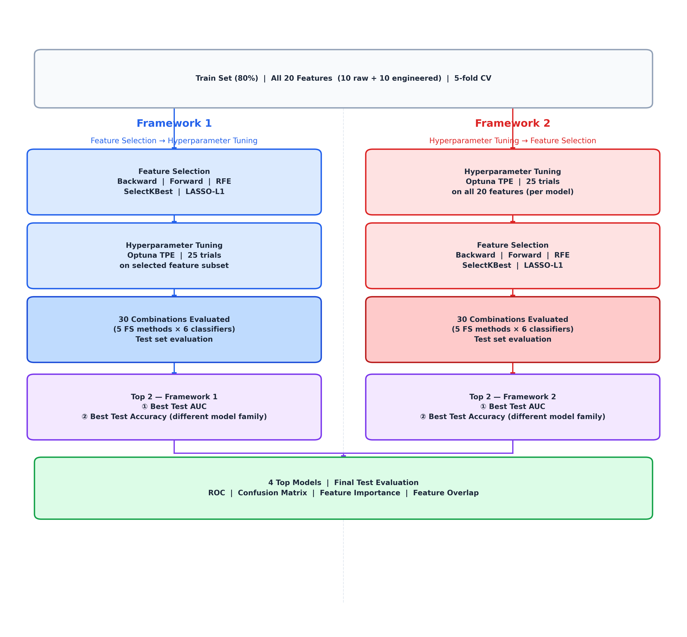
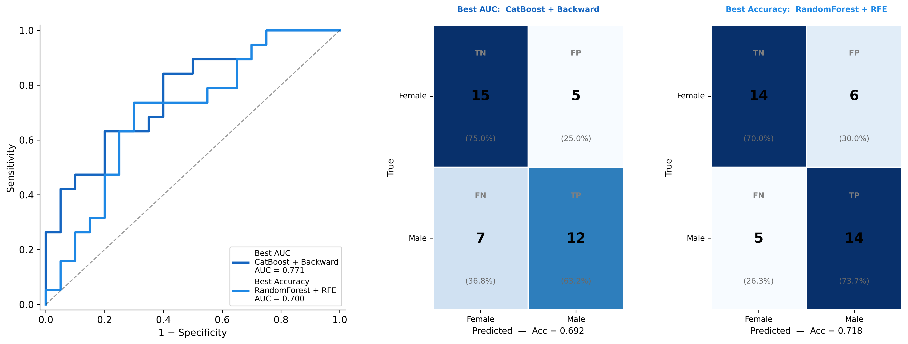
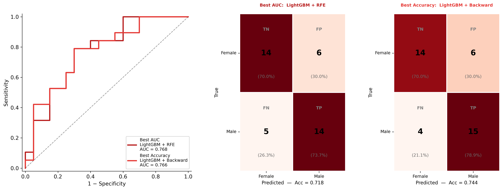
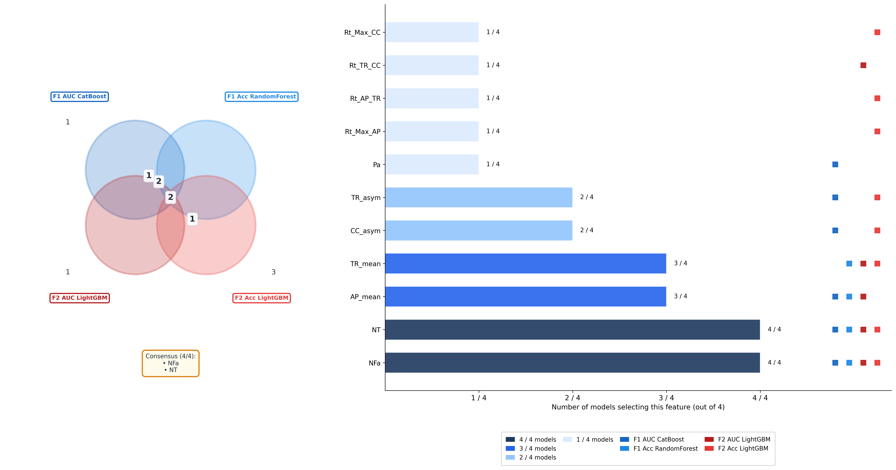

# Machine Learning-Driven Forensic Sex Prediction Using CT-Based Nasal and Maxillary Sinus Metrics

[](LICENSE)
[](requirements.txt)
[](#citation)

Reproducible machine learning pipeline for sex estimation from CT-based nasal and maxillary
sinus anthropometry in an Egyptian population, comparing two feature-selection /
hyperparameter-tuning framework orderings across six classifiers.

<!-- TODO(Khaled): replace with the live DOI link once the paper is published -->
📄 **Published in** *International Journal of Legal Medicine* — [DOI link](PASTE_PUBLISHED_LINK_HERE)

---

## Table of Contents

- [Overview](#overview)
- [Key Results](#key-results)
- [Study Population](#study-population)
- [Repository Structure](#repository-structure)
- [Methodology](#methodology)
- [Figures](#figures)
- [Getting Started](#getting-started)
- [Reproducibility](#reproducibility)
- [Data Availability](#data-availability)
- [Citation](#citation)
- [Authors](#authors)
- [Ethics](#ethics)
- [License](#license)

---

## Overview

Sex determination is a cornerstone of the forensic biological profile, especially when
conventional pelvic or cranial landmarks are unavailable due to fragmentation or decomposition.
The maxillary sinus and nasal skeleton are well-protected craniofacial structures that retain
measurable sexual dimorphism and are routinely visualized on paranasal sinus CT.

This study evaluates **CT-derived nasal and maxillary sinus anthropometry** for sex
classification in **195 adult Egyptians** (100 females, 95 males) drawn from two geographically
distinct cohorts — **Upper Egypt (Assiut, n=104)** and **Lower Egypt (Benha, n=91)** — using a
systematic, leakage-safe machine learning workflow built around **six classifiers**, **five
feature-selection methods**, and **Optuna-driven hyperparameter tuning**.

Two modelling frameworks were compared head-to-head to test whether the *order* of feature
selection and hyperparameter tuning affects downstream performance:

| Framework | Pipeline |
|---|---|
| **F1** | Feature Selection → Hyperparameter Tuning |
| **F2** | Hyperparameter Tuning → Feature Selection |

## Key Results

Framework 2 (Tune → FS) generally outperformed Framework 1 (FS → Tune). The best-performing
models achieved **AUCs of 0.771 and 0.768**, with the highest test **accuracy of 74.4%**.

| Framework | Selected by | Model | FS Method | Features | Accuracy (95% CI) | AUC (95% CI) |
|---|---|---|---|---|---|---|
| F1 (FS→Tune) | Best AUC | CatBoost | Backward Elimination | 6 | 0.692 (0.5–0.8) | **0.771** (0.6–0.9) |
| F1 (FS→Tune) | Best Accuracy | Random Forest | RFE | 4 | **0.718** (0.6–0.8) | 0.700 (0.5–0.9) |
| F2 (Tune→FS) | Best AUC | LightGBM | RFE | 5 | 0.718 (0.6–0.8) | **0.768** (0.6–0.9) |
| F2 (Tune→FS) | Best Accuracy | LightGBM | Backward Elimination | 9 | **0.744** (0.6–0.9) | 0.766 (0.5–0.9) |

*Performance on the independent 20% held-out test set (combined cohort). CI = 95% bootstrap
confidence interval (1000 resamples). Full 60-combination leaderboard in
[`results/maxilla_sex_classification_results.xlsx`](results/maxilla_sex_classification_results.xlsx).*

**Most robust predictors** (selected by all 4 top models, 4/4): mean anteroposterior maxillary
dimension (**AP_mean**), nasofrontal angle (**NFa**), and nasion–tip distance (**NT**).

Exploratory non-metric multidimensional scaling (nMDS) showed only partial separation between
sexes (Kruskal stress: combined = 0.211, Assiut = 0.192, Benha = 0.157), consistent with the
moderate — not high — classification ceiling observed across all models.

## Study Population

| Cohort | N | Female | Male | Age, mean ± SD |
|---|---|---|---|---|
| Assiut (Upper Egypt) | 104 | 53 (51.0%) | 51 (49.0%) | 35.93 ± 12.28 |
| Benha (Lower Egypt) | 91 | 47 (51.6%) | 44 (48.4%) | 34.93 ± 12.07 |
| **Combined** | **195** | **100 (51.3%)** | **95 (48.7%)** | **35.47 ± 12.16** |

No significant between-cohort differences in age or sex distribution (p = 0.54 and p = 0.92,
respectively), minimizing regional confounding.

## Repository Structure

```
ML_Forensic/
├── Final_code_v2.ipynb        # End-to-end pipeline: data → features → FS → tuning → figures
├── data/
│   ├── README.md               # How to obtain the raw dataset
│   └── New data.xlsx           # Not tracked in git — see Data Availability
├── results/                    # ML leaderboards & feature-importance tables (Excel)
│   ├── maxilla_sex_classification_results.xlsx
│   ├── supplementary_table.xlsx
│   ├── assiut_benha_best_results.xlsx
│   └── feature_importance_top4.xlsx
├── figures/                    # Publication-ready figures generated by the notebook
├── requirements.txt
├── LICENSE
└── README.md
```

## Methodology

**1. Feature engineering** — From 10 baseline measurements (6 maxillary sinus dimensions,
3 nasal angles/distances, age), 10 additional features were engineered: 4 bilateral shape
ratios (AP/TR, TR/CC per side), 3 bilateral asymmetry indices (`|R−L| / mean(R,L)`), and 3
bilateral means — yielding **20 features** for modelling.

**2. Split** — Stratified 80/20 train-test split (`random_state=42`), performed independently
for the combined cohort and each of the Assiut / Benha subsets.

**3. Feature selection** (train set only, via 5-fold stratified CV-AUC) — Backward Elimination,
Forward Selection, Recursive Feature Elimination (RFE), SelectKBest (ANOVA F-statistic), and
LASSO (L1-penalized logistic regression).

**4. Classifiers** — Logistic Regression, SVM (RBF), Random Forest, XGBoost, CatBoost, LightGBM.

**5. Hyperparameter tuning** — [Optuna](https://optuna.org/) with a TPE sampler, 25 trials per
model, maximizing mean 5-fold CV-AUC.

**6. Frameworks** — 5 FS methods × 6 models = 30 combinations, run under both orderings
(FS→Tune and Tune→FS), on the combined cohort and replicated on each regional subset.

**7. Evaluation** — Accuracy, AUC, precision, recall, F1, specificity on the held-out test set,
with 95% bootstrap confidence intervals (1000 resamples). Feature importance via native
gain-based scores (tree models) or permutation importance (LR/SVM, 20 repeats).

**8. Unsupervised exploration** — nMDS ordination on the top predictors of the best Framework 2
model to visualize male/female overlap per cohort.

## Figures

| Study Design | Modelling Frameworks |
|---|---|
|  |  |

| Framework 1 — ROC & Confusion Matrices | Framework 2 — ROC & Confusion Matrices |
|---|---|
|  |  |

Feature-selection frequency across all top models:



All figures (including nMDS ordination and Venn diagrams of shared/unique features) are in
[`figures/`](figures/).

## Getting Started

```bash
git clone <THIS_REPO_URL>
cd ML_Forensic

python3 -m venv .venv
source .venv/bin/activate        # Windows: .venv\Scripts\activate
pip install -r requirements.txt

# Request the raw dataset (see data/README.md) and place it at data/New data.xlsx,
# then run the notebook top to bottom:
jupyter notebook Final_code_v2.ipynb
```

## Reproducibility

- Global seed `SEED = 42` fixed across splitting, cross-validation, model init, and bootstrap CIs.
- Model development strictly confined to the training fold (5-fold stratified CV); the test set
  is touched only once, for final evaluation.
- Continuous features are z-score standardized (fit on train, applied to test) for
  scale-sensitive models (LR, SVM) only — tree-based models use raw features.
- Exact package versions pinned in [`requirements.txt`](requirements.txt).

## Data Availability

The raw, subject-level measurement file is **not included** in this repository. Per the
manuscript's Data Availability statement, it is available from the corresponding author on
reasonable request — see [`data/README.md`](data/README.md) for details and the expected
schema. This repository provides the full analysis code and the aggregate result tables
([`results/`](results/)) needed to verify and reproduce the reported findings.

## Citation

<!-- TODO(Khaled): fill in the real DOI / volume / pages once published, or replace with the
     journal's preferred citation export. -->

If you use this code or these findings, please cite:

> Fakher HM, Samir M, Farag AA, Abo Elela NAM, Abd-Elshafy SZ, Bayomy HE, Ghanem KM, Shaltout ES.
> Machine Learning-Driven Forensic Sex Prediction Using CT-Based Nasal and Maxillary Sinus
> Metrics. *International Journal of Legal Medicine*. [PASTE_YEAR];[PASTE_VOLUME]([PASTE_ISSUE]):[PASTE_PAGES].
> doi: [PASTE_DOI_HERE](PASTE_PUBLISHED_LINK_HERE)

```bibtex
@article{fakher_ml_forensic_sex,
  title   = {Machine Learning-Driven Forensic Sex Prediction Using CT-Based Nasal and Maxillary Sinus Metrics},
  author  = {Fakher, Haidy M. and Samir, Mohamed and Farag, Amina A. and Abo Elela, Nahed Ahmed Mahmoud and Abd-Elshafy, Shorouk Z. and Bayomy, Hanaa El-Sayed and Ghanem, Khaled M. and Shaltout, Eman S.},
  journal = {International Journal of Legal Medicine},
  year    = {PASTE_YEAR},
  doi     = {PASTE_DOI_HERE}
}
```

## Authors

| Author | Affiliation | Role |
|---|---|---|
| Haidy M. Fakher | Forensic Medicine & Clinical Toxicology, Benha University | Conceptualization, study design |
| Mohamed Samir | Univ. of Greenwich; Zagazig University | Data collection |
| Amina A. Farag | Forensic Medicine & Clinical Toxicology, Benha University | ML analysis, model development |
| Nahed A. M. Abo Elela | Radiology, Assiut University | Radiological assessment |
| Shorouk Z. Abd-Elshafy | Radiology, Benha University | Radiological assessment |
| Hanaa El-Sayed Bayomy | Community Medicine, Northern Border University / Benha University | Statistical analysis |
| Khaled M. Ghanem | Faculty of Computers and Artificial Intelligence, Cairo University | ML supervision, critical revision |
| **Eman S. Shaltout** (Corresponding) | Forensic Medicine & Clinical Toxicology, Assiut University | ML analysis, manuscript writing |

**Corresponding author:** Dr. Eman S. Shaltout — emansalahshaltout@aun.edu.eg ·
[ORCID](https://orcid.org/0000-0001-8963-0356)

## Ethics

Approved by the Assiut University Committee on Research Ethics (Approval No. 04-2025-300570),
conducted in compliance with the Declaration of Helsinki. Written informed consent was obtained
from all participants.

## License

Code released under the [MIT License](LICENSE). This covers the analysis pipeline only — see
[Data Availability](#data-availability) for the dataset's terms of access.
